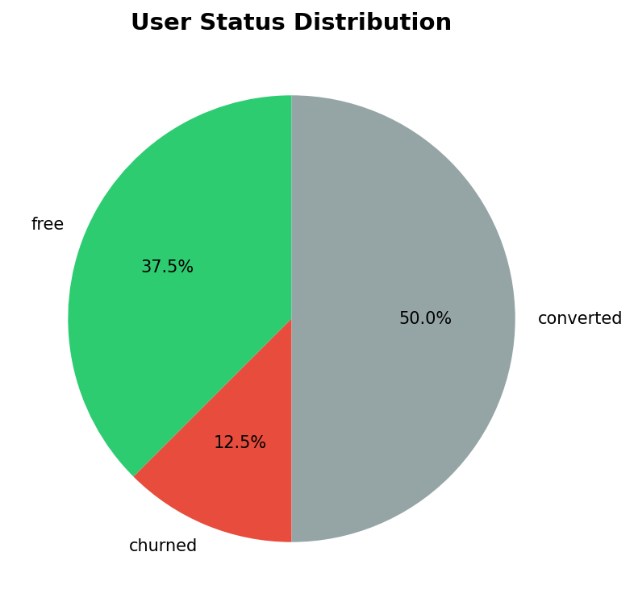
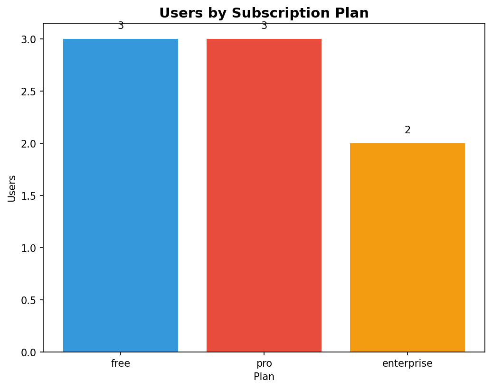
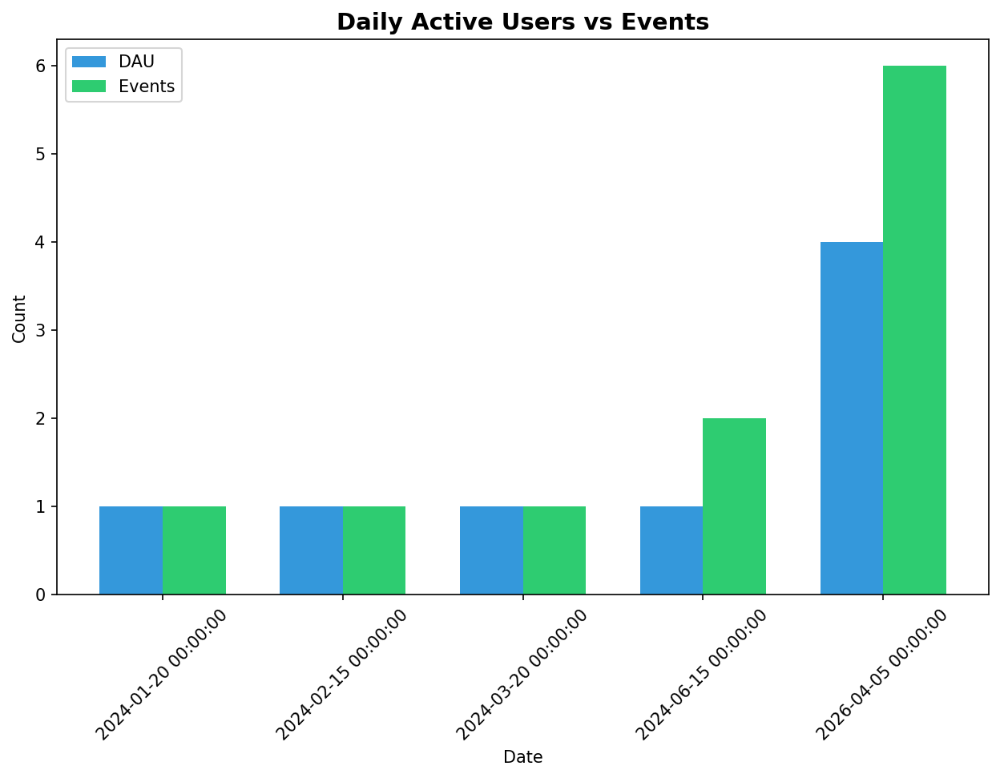

# Data Warehouse with dbt and DuckDB

  

A SQL-focused data warehouse project using dbt and DuckDB for SaaS/Telemetry analytics.

---

## Architecture

```
╔════════════════════════════════════════════════════════════════════════════════╗
║                           DATA WAREHOUSE ARCHITECTURE                        ║
╠════════════════════════════════════════════════════════════════════════════════╣
║                                                                              ║
║   ┌─────────────┐     ┌─────────────┐     ┌─────────────┐                ║
║   │  raw_users  │     │ raw_subscrp. │     │ raw_events  │   ← SEEDS       ║
║   └──────┬──────┘     └──────┬───────┘     └──────┬──────┘                  ║
║          └───────────────────┼───────────────────┘                           ║
║                              ▼                                                ║
║                      ┌───────────────┐                                        ║
║                      │   STAGING     │   ← 3 views (cleaned)                 ║
║                      │  stg_events   │                                        ║
║                      │  stg_users    │                                        ║
║                      │ stg_subscrp.  │                                        ║
║                      └───────┬───────┘                                        ║
║                              ▼                                                ║
║                      ┌───────────────┐                                        ║
║                      │  INTERMEDIATE │   ← 2 views (enriched)                 ║
║                      │ int_events_enr│                                        ║
║                      │int_users_sub. │                                        ║
║                      └───────┬───────┘                                        ║
║                              ▼                                                ║
║   ┌──────────────────────────┼──────────────────────────┐                     ║
║   ▼                          ▼                          ▼                     ║
║ ┌─────────────┐     ┌─────────────┐     ┌─────────────────────┐              ║
║ │ dim_users   │     │dim_subscrp. │     │    dim_events       │              ║
║ └─────────────┘     └─────────────┘     └─────────────────────┘              ║
║                                                        ▼                     ║
║                                                ┌───────────────┐            ║
║                                                │  fact_tables  │            ║
║                                                │ fact_events  │            ║
║                                                │fact_daily_mtr.│           ║
║                                                └───────────────┘            ║
║                               ← MARTS (final tables)                          ║
╚════════════════════════════════════════════════════════════════════════════════╝

LAYER FLOW:  RAW DATA → STAGING → INTERMEDIATE → MARTS
```

---

## Data Insights

### User Distribution by Status


### Users by Subscription Plan


### Daily Active Users vs Events


---

## Quick Start

```bash
cd data_warehouse_duckdb
python3 -m venv .venv
source .venv/bin/activate
pip install dbt-duckdb
dbt seed
dbt run
dbt test
```

---

## Models

| Model | Type | Description |
|-------|------|-------------|
| stg_events | View | Staged events |
| stg_users | View | Staged users |
| stg_subscriptions | View | Staged subscriptions |
| int_events_enriched | View | Events with user data |
| int_users_with_subscriptions | View | Users with subscription info |
| dim_users | Table | User dimension |
| dim_subscriptions | Table | Subscription dimension |
| dim_events | Table | Event dimension |
| fact_events | Table | Event fact table |
| fact_daily_metrics | Table | Daily aggregated metrics |

---

## Sample Data

### dim_users (User Dimension)
| user_id | email | plan | status | is_active |
|---------|-------|------|--------|-----------|
| usr_001 | alice@acme.com | pro | converted | true |
| usr_003 | carol@bigcorp.com | enterprise | converted | true |
| usr_004 | david@startup.co | pro | churned | false |
| usr_006 | frank@megacorp.com | enterprise | converted | true |
| usr_007 | grace@cloudtech.com | pro | converted | true |
| usr_002 | bob@techstart.io | free | free | true |
| usr_005 | eve@innovate.io | free | free | true |
| usr_008 | henry@dataflow.io | free | free | true |

### fact_daily_metrics (Daily Metrics)
| date | DAU | events | conversions | churn | MRR |
|------|-----|--------|-------------|-------|-----|
| 2024-01-20 | 1 | 1 | 1 | 0 | $29 |
| 2024-02-15 | 1 | 1 | 0 | 0 | $0 |
| 2024-03-20 | 1 | 1 | 0 | 0 | $0 |
| 2024-06-15 | 1 | 2 | 0 | 1 | $58 |
| 2026-04-05 | 4 | 6 | 0 | 0 | $384 |

---

## Testing

```bash
dbt test                    # Run all tests (23 tests)
dbt test --select dim_users # Run specific tests
```

---

## Project Structure

```
data_warehouse_duckdb/
├── models/
│   ├── staging/           # 3 views - clean raw data
│   ├── intermediate/     # 2 views - enrich data
│   └── marts/            # 5 tables - business metrics
├── seeds/                 # Sample CSV data
├── docs/                  # Architecture diagrams & charts
├── macros/                # Custom dbt macros
├── dbt_project.yml       # Project configuration
└── profiles.yml           # Database connection
```

---

## Tech Stack

- **dbt**: Data transformation
- **DuckDB**: Lightweight data warehouse
- **SQL**: Query language
- **Python**: Scripts & automation
